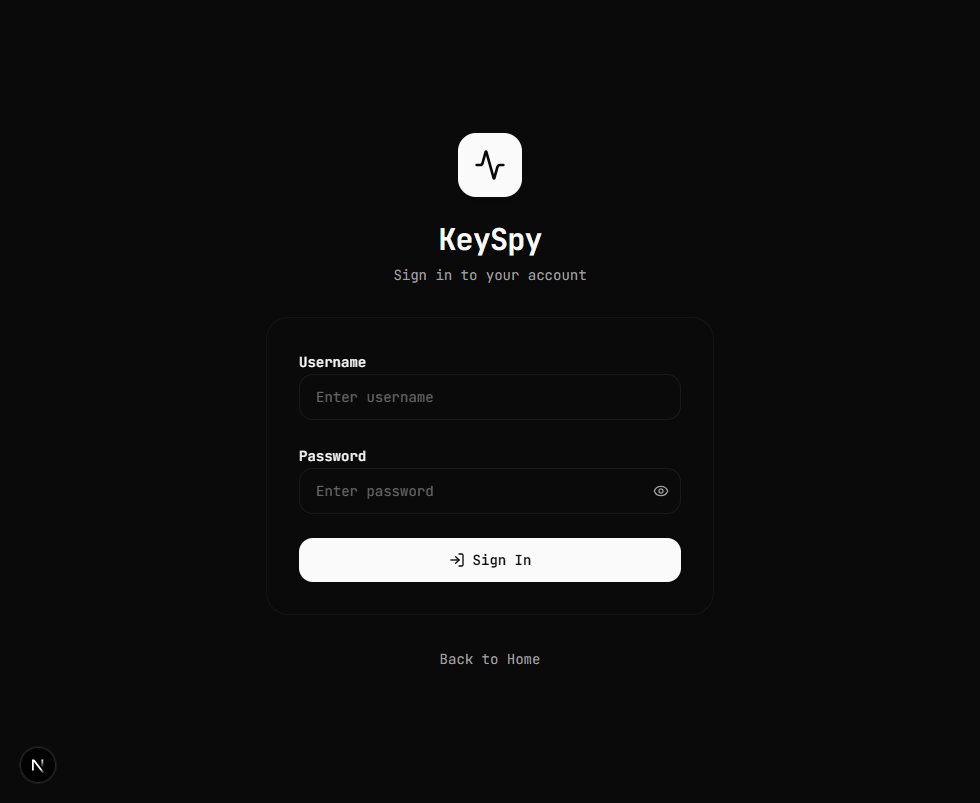
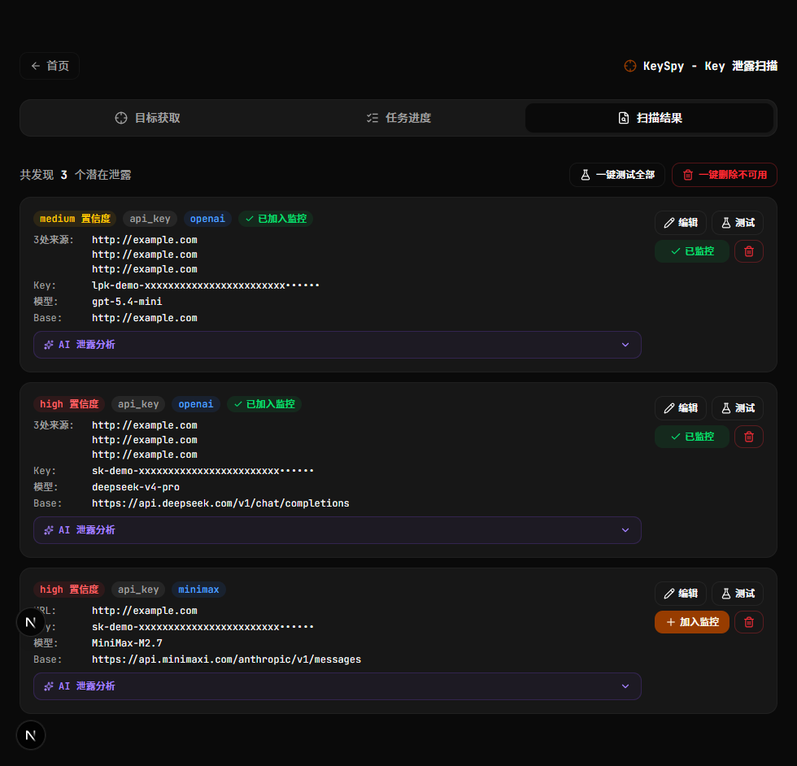
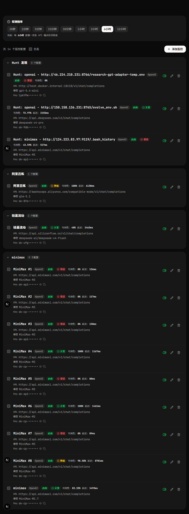
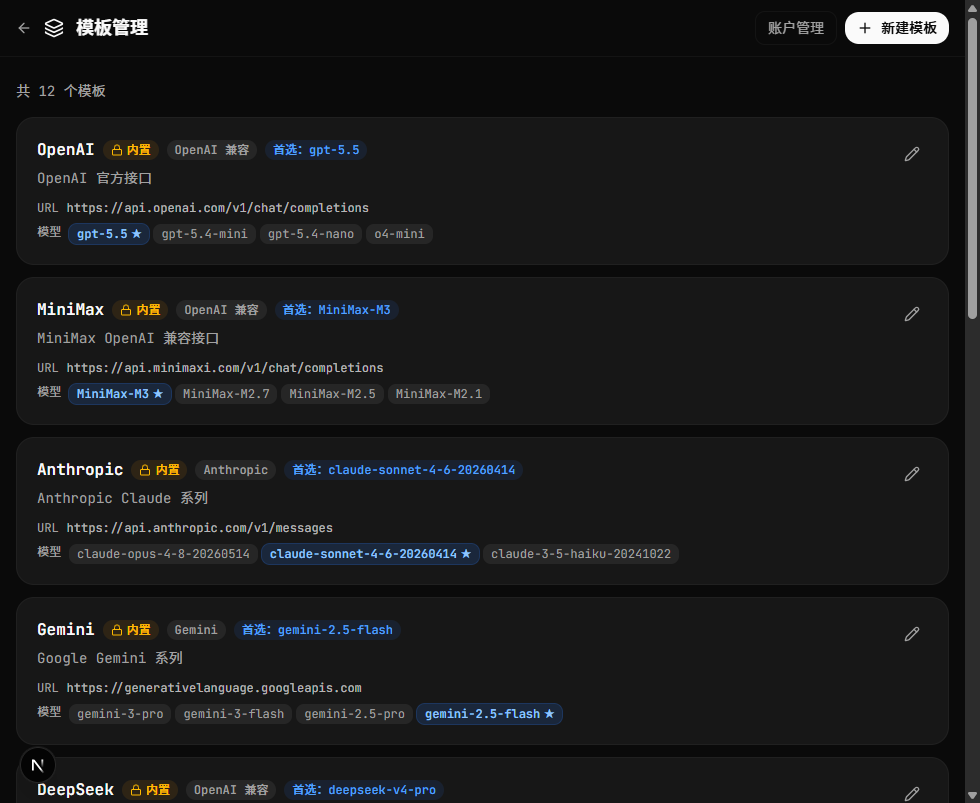
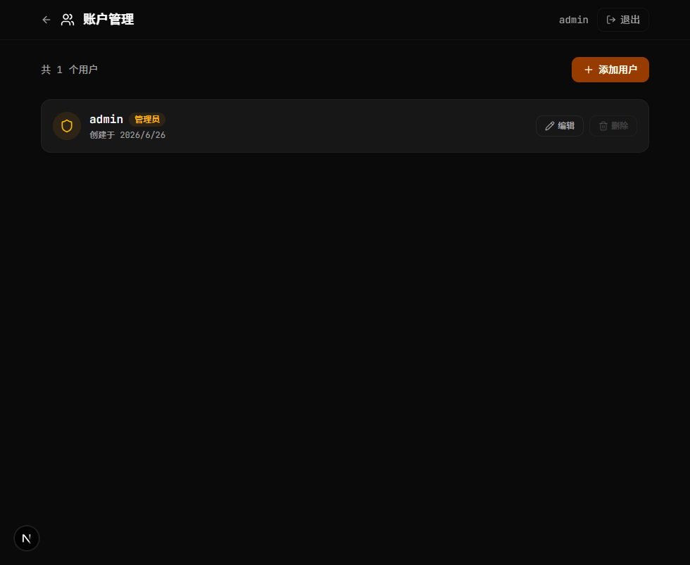

<div align="center">


# KeySpy

**AI API Key 泄露检测与可用性监控平台**

**AI API Key Leak Detection & Availability Monitoring Platform**

[中文](#中文) | [English](#english)


</div>

---

<a id="中文"></a>

# 中文

KeySpy 是一款自托管的 AI API Key 安全审计平台，集成了**敏感信息扫描（Hunt）**、**API 可用性监控**、**批量模型测试**等核心能力，帮助安全团队和开发者发现并管理互联网上泄露的大模型 API 密钥。

## 功能概览

| 模块 | 功能 | 说明 |
|------|------|------|
| **Hunt 扫描** | 全网敏感信息发现 | 自动爬取目标站点文件，通过 gitleaks + AI 双重引擎检测 API Key、密码、数据库连接串等泄露 |
| **Hunt 结果管理** | 扫描结果批量测试/删除 | 对发现的 Key 进行一键可用性测试，自动识别 Provider 和 Model |
| **API 监控** | LLM API 可用性监控 | 定时检测 OpenAI / Anthropic / Gemini 等 API 端点的响应状态 |
| **批量测试** | 多模型并发测试 | 支持批量添加监控配置，一键测试全部 API 可用性 |
| **模板管理** | 监控配置模板 | 创建可复用的监控模板，快速批量部署 |
| **LLM 管理** | AI 模型配置 | 管理 Chat 模型（用于 AI 辅助分析），支持多 Provider |
| **分组视图** | 按 Provider 分组 | 按厂商维度查看监控状态和可用性趋势 |
| **账户管理** | 多用户 + 角色控制 | 管理员/普通用户角色隔离 |

## 核心特色

> **真实 API 调用验证，而非简单的端口连通检测**

区别于仅验证 HTTP 200 状态码的工具，KeySpy 会对发现的每个 API Key 发起**真实的 LLM 推理请求**，确认密钥背后确实存在可用的大模型服务：

- **Say Hello 验证** — 向目标 API 发送 `"Say hello in exactly one word."` 指令，只有模型**真实返回响应**才算密钥可用，HTTP 200 但无内容的假端点将被准确排除
- **全模板模型遍历** — 测试一个 Key 时，自动遍历系统中**所有内置模板的全部模型列表**（default_model + 备选模型），深度挖掘该 Key 能调用哪些厂商、哪些模型，第一个成功的模型即标记该模板可用
- **多 URL 格式自动探测** — 对每个目标 Base URL，自动尝试多种路径格式（`/v1/chat/completions`、`/chat/completions`、已知厂商专属路径等），确保不因 URL 拼接问题漏报
- **智能挑战验证（可选）** — 通过随机生成的「语言理解挑战」（分类选择题 / 阅读理解大海捞针），验证 API 端点背后是**真实的 LLM** 而非伪装的代理服务器
- **推理模型兼容** — 自动剥离 DeepSeek-R1、QwQ 等推理模型的 `<think>` 标签内容，确保对思考型模型的正确判定

```
                    发现 API Key
                         ↓
              ┌──── 测试单个 Key ────┐
              │                      │
              ▼                      ▼
       遍历候选 URL 格式       遍历所有模板
       (/v1/chat/completions    (OpenAI / Anthropic /
        /chat/completions        Gemini / DeepSeek /
        厂商专属路径...)          MiniMax / 通义千问...)
              │                      │
              ▼                      ▼
        发送真实推理请求       遍历模板内全部模型
        "Say hello..."         (default + fallbacks)
              │                      │
              ▼                      ▼
        模型真实返回响应?       找到第一个成功模型
        ──────────────          即标记该模板可用
        ✅ 真实 LLM 响应
        ❌ 假端点 / 无内容
```

## 技术架构

```
┌─────────────────────────────────────────────────┐
│                  Next.js 全栈                     │
├─────────────────────┬───────────────────────────┤
│     前端 (React)     │       后端 (API Routes)    │
│  - Tailwind + shadcn│  - gitleaks 扫描引擎       │
│  - 暗色/亮色主题     │  - AI 分析 (Vercel AI SDK) │
│  - 响应式布局        │  - SQLite 持久化存储       │
│  - 实时状态更新      │  - Session Cookie 认证     │
└─────────────────────┴───────────────────────────┘
```

### 技术栈

- **框架**: Next.js 16 (Turbopack)
- **UI**: React 19 + Tailwind CSS 4 + shadcn/ui + Radix UI
- **数据库**: SQLite (better-sqlite3)
- **扫描引擎**: gitleaks + 自定义增强规则
- **AI 分析**: Vercel AI SDK（支持 OpenAI / Anthropic / Google）
- **测试框架**: Vitest

### 支持的 LLM Provider

| Provider | 识别特征 |
|----------|---------|
| OpenAI | `sk-` 前缀, `openai.com` |
| Anthropic | `sk-ant-` 前缀, `anthropic.com` |
| Google (Gemini) | `AIza` 前缀 |
| MiniMax | `sk-cp-` 前缀, `minimaxi.com` |
| 通义千问 (DashScope) | `sk-` 前缀, `dashscope` / `bailian` |
| 火山引擎 (Volcengine) | UUID 格式, `volces.com` |
| SiliconFlow | `siliconflow` 关键词 |
| DeepSeek | `deepseek` 关键词 |
| 百川 / Moonshot / 智谱 / 零一万物 / StepFun | 上下文关键词匹配 |

## 快速开始

### 环境要求

- Node.js >= 18
- pnpm >= 10
- gitleaks（已内置于 `tools/gitleaks/`）

### 安装与运行

```bash
# 克隆仓库
git clone https://github.com/hyperion-wei/keyspy.git
cd keyspy

# 安装依赖
pnpm install

# 开发模式
pnpm dev

# 构建
pnpm build

# 生产启动
pnpm start

# 运行测试
pnpm test
```

打开 [http://localhost:3000](http://localhost:3000)

### 默认账户

| 用户名 | 密码 | 角色 |
|--------|------|------|
| admin | admin123 | 管理员 |

> 首次登录后请立即修改密码。

## 项目结构

```
keyspy/
├── app/
│   ├── api/                 # API 路由
│   │   ├── auth/            # 认证（登录/登出/会话）
│   │   ├── hunt/            # Hunt 扫描引擎
│   │   │   ├── scan/        # 扫描任务（爬取+gitleaks+AI分析）
│   │   │   ├── results/     # 扫描结果查询
│   │   │   ├── tasks/       # 任务状态查询
│   │   │   ├── test/        # 单 Key 可用性测试
│   │   │   └── test-all/    # 批量测试
│   │   ├── monitors/        # 监控配置 CRUD
│   │   ├── templates/       # 模板管理
│   │   ├── chat/            # AI 对话
│   │   ├── dashboard/       # 仪表盘数据
│   │   └── users/           # 账户管理
│   ├── hunt/                # Hunt 扫描页面
│   ├── manage/              # 管理页面
│   │   ├── accounts/        # 账户管理
│   │   ├── llm/             # LLM 配置管理
│   │   └── templates/       # 模板管理
│   ├── group/[groupName]/   # 分组视图
│   └── login/               # 登录页
├── components/              # UI 组件
├── lib/                     # 核心库
│   ├── db.ts                # SQLite 数据库
│   ├── auth.ts              # 认证逻辑
│   ├── checker.ts           # API 可用性检测
│   └── poller.ts            # 定时轮询
├── tools/gitleaks/          # gitleaks 引擎 + 增强规则
├── data/                    # SQLite 数据库文件
└── test-screens/            # 测试截图
```

## 核心流程

### Hunt 扫描流程

```
目标 URL
  ↓
1. 爬取下载文件（crawlAndDownload）
  ↓
2. gitleaks 默认规则扫描 + 增强规则扫描（JSON apiKey / 连接串 / 密码等）
  ↓
3. 结果合并去重（mergeAndFilterReports）
  ↓
4. 结果映射（mapToFindings）→ 过滤短匹配
  ↓
5. 分类识别（classifyFinding）
   - 已知 Provider → 高置信度
   - 上下文推断 → 中置信度
   - 前缀/UUID 回退 → 中/低置信度
  ↓
6. 同文件聚合 + 按 Key 去重
  ↓
7. AI 分析（analyzeFindings）→ 补充 model / base_url
  ↓
8. 存储到数据库
```

### 监控流程

```
定时任务（poller）
  ↓
检测各 API 端点响应
  ↓
记录状态 → 更新仪表盘 → 异常告警
```

## 环境变量

| 变量名 | 说明 | 默认值 |
|--------|------|--------|
| `PORT` | 服务端口 | 3000 |
| `DATABASE_PATH` | SQLite 数据库路径 | `./data/app.db` |
| `NEXT_DISABLE_STANDALONE` | 禁用 standalone 输出 | - |
| `NEXT_PUBLIC_BASE_URL` | 公开访问地址（SEO 用） | - |

## API 端点

| 方法 | 端点 | 说明 |
|------|------|------|
| POST | `/api/auth` | 登录/登出 |
| GET | `/api/dashboard` | 仪表盘数据 |
| POST | `/api/monitors` | 创建监控（单个/批量） |
| GET | `/api/monitors` | 获取所有监控 |
| POST | `/api/hunt/scan` | 发起扫描 |
| POST | `/api/hunt/test` | 测试单个 Key |
| POST | `/api/hunt/test-all` | 批量测试 Key |
| GET | `/api/templates` | 获取模板列表 |
| GET/POST/PUT/DELETE | `/api/users` | 账户管理（仅管理员） |

## 版本历史

详见 [CHANGELOG.md](./CHANGELOG.md)

[⬆ 返回顶部](#中文)

---

<a id="english"></a>

# English

KeySpy is a self-hosted platform for detecting leaked AI API keys in codebases and monitoring their availability in real-time. It scans source code, configuration files, and chat histories for exposed keys, validates them against LLM provider APIs, and provides a comprehensive monitoring dashboard with automatic model failover.

## Highlights

> **Real API call validation — not just HTTP 200 checks**

Unlike tools that merely verify HTTP 200 status codes, KeySpy issues **real LLM inference requests** to confirm that a discovered API key actually powers a working language model:

- **Say Hello Validation** — Sends `"Say hello in exactly one word."` to each target API; only counts the key as usable when the model **actually returns a response**, accurately filtering out fake endpoints that respond with 200 but no content
- **Full Template Model Traversal** — When testing a single key, KeySpy automatically iterates through **every model in every built-in template** (default model + all fallback models), deeply mining which providers and models the key can access; the first successful model marks that template as usable
- **Multi-URL Format Auto-Probing** — For each target Base URL, automatically tries multiple path formats (`/v1/chat/completions`, `/chat/completions`, known provider-specific paths, etc.) to ensure no valid endpoint is missed due to URL concatenation issues
- **Intelligent Challenge Verification (optional)** — Randomly generated "language understanding challenges" (category selection / reading comprehension needle-in-a-haystack) verify the endpoint is a **genuine LLM** rather than a disguised proxy server
- **Reasoning Model Compatibility** — Automatically strips `<think>` tags from reasoning models (DeepSeek-R1, QwQ, etc.) to ensure correct validation of thinking-capable models

```
                 Discovered API Key
                         ↓
              ┌──── Test Single Key ────┐
              │                         │
              ▼                         ▼
       Probe URL formats         Traverse all templates
       (/v1/chat/completions     (OpenAI / Anthropic /
        /chat/completions         Gemini / DeepSeek /
        provider-specific...)      MiniMax / DashScope...)
              │                         │
              ▼                         ▼
        Send real inference      Try every model in
        request "Say hello..."   template (default +
              │                  all fallbacks)
              ▼                         ▼
        Model returns real       First success marks
        response?                template as usable
        ──────────────
        ✅ Genuine LLM response
        ❌ Fake endpoint / no content
```

## Features

### Key Leak Detection (Hunt)
- **Smart Scanning** — Scans files and directories for AI API key patterns (OpenAI, Anthropic, Gemini, DeepSeek, MiniMax, etc.)
- **AI-Powered Analysis** — Uses LLM to classify found keys as active, inactive, or test keys
- **Concurrent Batch Testing** — Test all discovered keys simultaneously with live API validation
- **Auto Model Detection** — For each key, tests all provider models and identifies which ones work

### Availability Monitoring
- **Real-time Dashboard** — Overview of all monitored API endpoints with status indicators and latency
- **Automatic Failover** — When the primary model fails, automatically falls back to the next available model in the template's model list
- **Template System** — Built-in templates for OpenAI, Anthropic, Gemini, DeepSeek, MiniMax with customizable models
- **Group Management** — Organize monitors by group with per-group dashboards

### Administration
- **Role-Based Access** — Admin and user roles with granular permission control
- **Account Management** — Full user CRUD with admin-only access to sensitive operations
- **Batch Key Import** — Add multiple API keys at once with automatic model availability testing
- **Dark/Light Theme** — Full theme support with system preference detection

### Security
- **Parameterized SQL** — All database queries use parameterized statements to prevent SQL injection
- **Session-Based Auth** — Secure cookie-based authentication with bcrypt password hashing
- **Local-First** — All data stored in local SQLite, no external database required
- **No Open Registration** — Registration disabled by default, admin-managed accounts only

## Screenshots

### Login

<div align="center">
  
  <p><em>Clean, minimal login interface with secure session management</em></p>
</div>

### Dashboard

<div align="center">
  
  <p><em>Real-time overview of all monitored API endpoints with status, latency, and active model indicators</em></p>
</div>

### Key Leak Scanner (Hunt)

<div align="center">
  
  <p><em>Scan codebases for leaked API keys, validate them live, and add working keys to monitoring</em></p>
</div>

### Monitor Management

<div align="center">
  
  <p><em>Configure monitoring with template-based batch creation, automatic model detection, and fallback chains</em></p>
</div>

### Template Management

<div align="center">
  
  <p><em>Built-in templates for major LLM providers with customizable model lists and endpoints</em></p>
</div>

### Account Management

<div align="center">
  
  <p><em>Admin-only user management with role assignment and password management</em></p>
</div>

## Quick Start

### Prerequisites

- **Node.js** >= 18
- **pnpm** (recommended) or npm

### Installation

```bash
# Clone the repository
git clone https://github.com/hyperion-wei/keyspy.git
cd keyspy

# Install dependencies
pnpm install

# Start development server
pnpm dev
```

Open [http://localhost:3000](http://localhost:3000) in your browser.

**Default credentials:** `admin` / `admin123`

> Change the default password immediately after first login.

### Production Build

```bash
pnpm build
pnpm start
```

### Docker

```bash
docker build -t keyspy .
docker run -p 3000:3000 keyspy
```

## Architecture

```
keyspy/
├── app/
│   ├── api/                 # API route handlers
│   │   ├── auth/            # Authentication (login/logout/session)
│   │   ├── dashboard/       # Dashboard data aggregation
│   │   ├── hunt/            # Key scanning, testing, and results
│   │   ├── monitors/        # Monitor CRUD + batch creation
│   │   ├── templates/       # Template management
│   │   └── users/           # User administration
│   ├── hunt/                # Key leak scanner UI
│   ├── login/               # Authentication page
│   ├── manage/              # Monitor configuration UI
│   │   ├── accounts/        # User management
│   │   ├── llm/             # LLM chat settings
│   │   └── templates/       # Template editor
│   ├── group/[groupName]/   # Per-group dashboard
│   └── page.tsx             # Main dashboard
├── components/              # Shared UI components
├── lib/
│   ├── db.ts               # SQLite database layer
│   ├── auth.ts             # Authentication utilities
│   ├── checker.ts          # API availability checker
│   ├── test-utils.ts       # Shared model testing functions
│   └── challenge.ts        # Key validation challenges
└── data/                   # SQLite database files
```

## Tech Stack

| Layer | Technology |
|-------|-----------|
| Framework | Next.js 16 (App Router) |
| UI | React 19, shadcn/ui, Tailwind CSS 4 |
| Database | SQLite (better-sqlite3) |
| Auth | Session cookies + bcryptjs |
| AI SDK | Vercel AI SDK (OpenAI, Anthropic, Gemini) |
| Language | TypeScript |
| Package Manager | pnpm |

## Configuration

### Environment Variables

Create a `.env.local` file:

```bash
# Optional: customize session secret
SESSION_SECRET=your-random-secret-here

# Optional: admin email whitelist (comma-separated)
ADMIN_EMAILS=admin@example.com
```

### Default Admin Account

The admin account (`admin` / `admin123`) is automatically created on first startup. Use the **Account Management** page to create additional users.

## API Endpoints

| Method | Endpoint | Description |
|--------|----------|-------------|
| POST | `/api/auth` | Login/Logout |
| GET | `/api/dashboard` | Dashboard data |
| POST | `/api/monitors` | Create monitor (single/batch) |
| GET | `/api/monitors` | List all monitors |
| POST | `/api/hunt/scan` | Scan for leaked keys |
| POST | `/api/hunt/test` | Test single key |
| POST | `/api/hunt/test-all` | Test key against all templates |
| GET | `/api/templates` | List templates |
| GET/POST/PUT/DELETE | `/api/users` | User management (admin only) |

## Changelog

See [CHANGELOG.md](./CHANGELOG.md)

## License

MIT

[⬆ Back to Top](#english)
